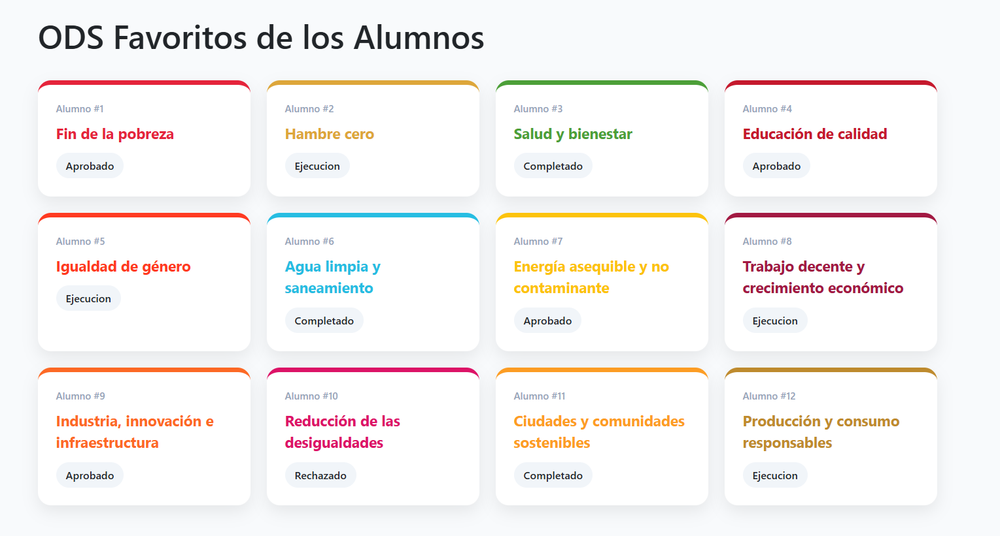

## Node.js

Node.js es un entorno que permite ejecutar JavaScript fuera del navegador. 
Normalmente se utiliza para crear aplicaciones en el servidor o para ejecutar herramientas de desarrollo. 
En proyectos web modernos también se usa para instalar dependencias y ejecutar scripts mediante npm.

## Vite

Vite es una herramienta que facilita la creación y ejecución de proyectos web. 
Su función principal es iniciar un servidor de desarrollo rápido y compilar el código para que podamos ver los cambios en el navegador casi al instante. 
Se utiliza mucho en proyectos con frameworks modernos como React o Vue.

## React

React es una librería de JavaScript que se utiliza para crear interfaces de usuario. 
Permite dividir una página web en componentes reutilizables, lo que hace que el código sea más fácil de mantener y organizar. 
Además, React actualiza automáticamente la interfaz cuando cambian los datos de la aplicación.

